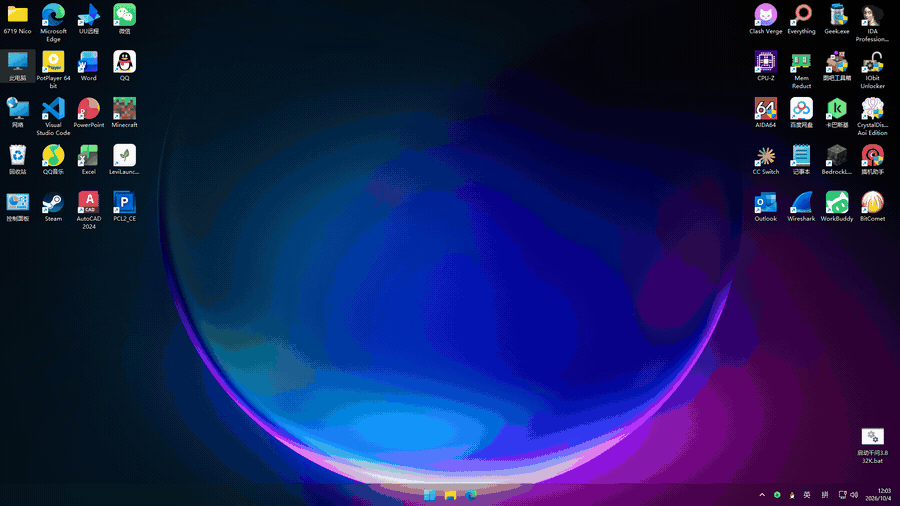

> **Not in Windhawk's catalogue yet.** The mod is under review
> ([ramensoftware/windhawk-mods#5899](https://github.com/ramensoftware/windhawk-mods/pull/5899)).
> Until it is accepted, install it from source - see [安装说明.md](安装说明.md).
> The GIF below is a real recording; the source in this repository is what the pull request contains.

# Mobile Open Animation

Windows apps open the way they do on a phone: the window zooms open from the icon you
clicked, and fades in, instead of appearing all at once. The app icon keeps its size
the whole time; only the frame grows.

Works from desktop icons, the taskbar, the Start menu and search, and from
double-clicking a file that starts a program. It also covers the case where the icon you
click belongs to an app that is already running and the click is what brings its hidden
window back up.

## Settings

Open the mod's "Settings" tab in Windhawk. The ones you are most likely to touch:

- **Zoom a splash panel with the app icon** - on by default, and what the animation
  above shows: a panel carrying the app icon appears the instant you click and zooms
  open, and hands over to the real window once it has painted. Turn it off to animate
  the real window instead: cheaper, but a slow-starting app shows no visible animation.
- **Zoom origin** - where the window grows out from. The default is the icon you
  clicked, which is the point of the mod; the other choices are the window centre and
  the bottom of the screen.
- **Start size** - the size of the square the animation starts from. 96 (the default)
  is roughly a desktop icon at 96 DPI.
- **Duration / Panel fade-out** - how fast the animation runs. Phones use 200-300ms.
- **Frame interval** - 0 follows the monitor's refresh rate, which is what you want on a
  high-refresh display.
- **Excluded window classes** - the mod ships with a list of window classes it never
  touches (UWP hosts, tray and tooltip windows, the desktop, and so on). Add your own
  here if a program misbehaves. To keep the mod out of a whole process instead, use
  Windhawk's own process exclusion list in the mod's Advanced tab - that also avoids
  loading the mod there at all.

Everything else has a description in the settings panel.

## What has no animation

- **UWP / WinUI apps** - Windows 11 Notepad, Settings, Terminal, Calculator, Photos and
  so on. They animate themselves, so the mod skips them on purpose. Note that
  `C:\Windows\System32\notepad.exe` may not even exist on Windows 11 (Notepad is a
  Store app now), so **do not use Notepad to test**.
- **Online games with anti-cheat, and security suites** - they refuse to be injected, so
  the mod cannot get in.
- **Dialogs** - off by default. There is a setting to enable them.
- **A window another program shows** - clicking an icon that wakes up an app which is
  already running does animate: the show is handed to that app, which animates its own
  window. The one case still left alone is a program that shows the window while also
  setting its position or placement in the same call.
- **System UI hosts** - the shell experience hosts, the Start menu, search, the lock
  screen and a few more are excluded from the mod entirely, so it is not even loaded
  into them.
- Windows with absurdly small sizes.

## A program has no animation, now what

1. Open Windhawk, go to this mod's page and turn logging on for it (that switch is in
   Windhawk's own interface, not a mod setting).
2. Start that program once.
3. Read the log in Windhawk.

The decision for every window and the reason it was skipped are written there, with the
timings. Attach it to an issue and it can be diagnosed.

## Together with other animation mods

**Windows Animations** has an "Animate app launches" option of its own. Both mods hook
the same window-shown path and cloak the same windows, so **enable only one of the two
launch animations**. What is unique here is growing the window out of the icon you
clicked, and the icon splash panel; Windows Animations covers minimize, restore and
close, and an app-launch animation without the icon.

## Note

This mod applies to almost every process, matching Windhawk's own injection scope.
**Quit Windhawk before playing online games with anti-cheat**, or add the game to
Windhawk's process exclusion list.

---

## 中文

让 Windows 应用像手机那样「打开」：窗口从你点击的图标处放大铺开并淡入，而不是整块弹出来。
图标在整段动画里保持原大小，只有外框在长大。

桌面图标、任务栏、开始菜单和搜索、双击文件启动程序都支持。点一个已经在运行的应用的图标、
由这次点击把它隐藏的窗口调出来时，也有动画。

### 设置

在 Windhawk 里打开本 mod 的「设置」标签页。常用的几个：

- **用图标占位面板做展开动画** —— 默认开，就是上面动图的效果：点下去立刻出现一块带应用图标的
  占位面板并放大铺开，等真窗口画好再交接。关掉后改成直接动画窗口本身，更省资源，但对启动慢的
  应用会看不出动画。
- **缩放锚点** —— 窗口从哪儿长出来。默认「你点击的图标」（这就是本 mod 的卖点），另外还有
  窗口中心和屏幕底部。
- **起始边长** —— 动画从多大的方块开始。96（默认）大约就是桌面图标的大小。
- **时长 / 面板淡出时长** —— 动画快慢。手机一般是 200-300ms。
- **帧间隔** —— 0 跟随显示器刷新率（高刷屏就该用这个）。
- **排除的窗口类名** —— mod 自带一份永不触碰的窗口类清单（UWP 宿主、托盘与提示窗口、桌面等）。
  某个程序表现异常时把它的类名加进去。要整个进程都不参与，请用本 mod「高级」标签页里 Windhawk
  自带的进程排除列表 —— 那样还能连带避免把 mod 加载进去。

其余设置项都带内置说明，鼠标移上去就能看到。

### 哪些窗口不会有动画

- **UWP / WinUI 应用** —— Win11 的记事本、设置、终端、计算器、照片等。它们有自己的打开动画，
  本 mod 会主动跳过。另外 Win11 上 `C:\Windows\System32\notepad.exe` 可能根本不存在
  （记事本已是商店版），**不要用记事本测试**。
- **带反作弊的在线游戏、杀毒软件** —— 这些程序拒绝被注入，mod 无从下手。
- **对话框** —— 默认不做动画，可以在设置里打开。
- **别的进程的窗口** —— 点图标唤醒一个已经在运行的实例时，这次「显示」会交给那个进程，由它给
  自己的窗口做动画，所以照样有动画。只有「连窗口位置或大小一起设置」的那种显示方式仍然不做。
- **系统界面宿主** —— 壳体验宿主、开始菜单、搜索、锁屏等进程被整体排除，mod 根本不会被加载进去。
- 尺寸异常小的窗口。

### 某个程序没有动画，怎么办

1. 打开 Windhawk，在本 mod 的页面里为它打开日志开关（那是 Windhawk 界面里的开关，不是 mod 设置）。
2. 启动那个程序一次。
3. 在 Windhawk 里看日志。

每个窗口的判定结果、跳过原因和各阶段耗时都在里面。贴到 issue 里就能定位。

### 和别的动画 mod 一起用

**Windows Animations** 也有自己的「Animate app launches」选项。两个 mod 都挂窗口显示路径、
都给同一批窗口做 cloak，所以这两个「打开动画」**只能开一个**。本 mod 独有的东西是「从你点的
图标处放大」和那块图标占位面板；Windows Animations 管的是最小化、还原、关闭，以及没有图标的
打开动画。

### 注意

本 mod 作用于几乎所有进程，和 Windhawk 本身的注入范围一致。
**玩带反作弊的在线游戏之前请先退出 Windhawk**，或者把游戏加进 Windhawk 的进程排除列表。
